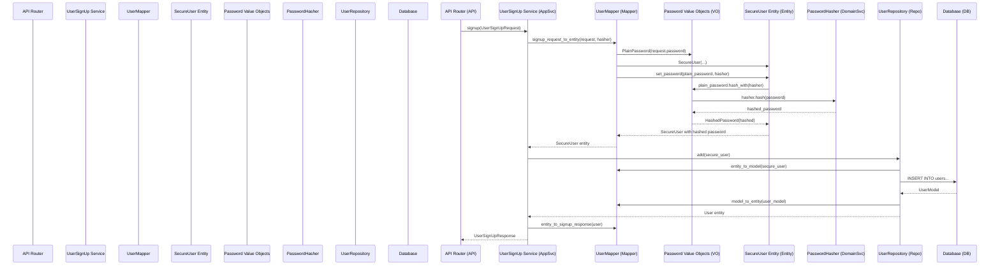
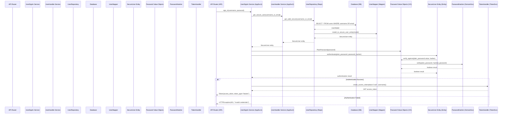
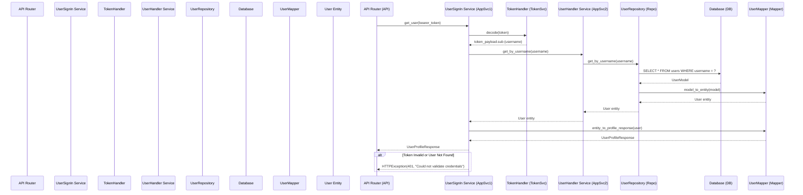

# **Domain-Driven Design (DDD) Implementation Guide**
## Complete Authentication System Architecture Briefing

---

## 🎯 **Executive Summary**

We've refactored our authentication system from a traditional layered architecture to a **Domain-Driven Design (DDD)** approach. This transformation provides:

- **Clear separation of business logic** from technical concerns
- **Improved testability** through isolated domain models
- **Better maintainability** with explicit architectural boundaries
- **Stronger type safety** using value objects and domain services

---

## 🏗️ **DDD Architecture Overview**

### **Layer Structure**

```
┌─────────────────────────────────────────┐
│            Interface Layer              │  ← API Routes, DTOs
│  (routers/, contracts/, schemas/)       │
├─────────────────────────────────────────┤
│           Application Layer             │  ← Use Case Orchestration
│     (services/user_signin.py, etc.)    │
├─────────────────────────────────────────┤
│             Domain Layer                │  ← Business Logic
│  (entities/, value_objects/, domain     │
│   services like password_hasher.py)     │
├─────────────────────────────────────────┤
│          Infrastructure Layer           │  ← Data Access, External APIs
│  (repositories/, mappers/, db/)         │
└─────────────────────────────────────────┘
```

---

## 🔄 **Authentication Flow Diagrams**

### **1. User Registration Flow**



### **2. User Sign-In Flow**



### **3. Get Current User (/me) Flow**



---

## 🏛️ **DDD Components Deep Dive**

### **1. Domain Layer - Business Core**

#### **Entities** (`api/entities/user.py`)
**Purpose:** Core business objects with identity and lifecycle

```python
@dataclass
class User:
    """User domain entity representing the core business object"""
    id: Optional[UUID] = field(default=None)
    username: Optional[str] = field(default=None)
    email: Optional[str] = field(default=None)
    first_name: Optional[str] = field(default=None)
    last_name: Optional[str] = field(default=None)
    created_at: Optional[datetime] = field(default=None)
    is_active: bool = field(default=True)
    
    def get_full_name(self) -> str:
        """Business logic: Get user's full name"""
        return f"{self.first_name or ''} {self.last_name or ''}".strip()

@dataclass
class SecureUser(User):
    """Extended entity for authentication scenarios"""
    password: Optional[HashedPassword] = field(default=None)

    def set_password(self, plain_password: PlainPassword, password_hasher: "IPasswordHasher") -> None:
        """Business logic: Set user's password securely"""
        if password_hasher is None:
            raise ValueError("Password hasher is not set")
        self.password = plain_password.hash_with(password_hasher)
    
    def authenticate(self, plain_password: PlainPassword, password_hasher: "IPasswordHasher") -> bool:
        """Business logic: Authenticate user credentials"""
        if self.password is None or password_hasher is None:
            return False
        return self.password.verify_against(plain_password.value, password_hasher)
```

**Key Principles:**
- ✅ **Identity**: Unique ID distinguishes entities
- ✅ **Business Methods**: `authenticate()`, `set_password()` contain domain logic
- ✅ **Inheritance**: `SecureUser` extends `User` for specialized scenarios
- ✅ **Dependencies**: Uses value objects and domain services

#### **Value Objects** (`api/value_objects/password.py`)
**Purpose:** Immutable domain concepts without identity

```python
@dataclass(frozen=True)
class PlainPassword:
    """Value object for plain text password with validation"""
    value: str
    
    def hash_with(self, hasher: 'IPasswordHasher') -> HashedPassword:
        """Convert to hashed password using domain service"""
        return HashedPassword.from_plain(self.value, hasher)

@dataclass(frozen=True) 
class HashedPassword:
    """Value object representing a hashed password"""
    value: Optional[str] = field(default=None)
    
    @classmethod
    def from_plain(cls, plain_password: str, hasher: 'IPasswordHasher') -> Self:
        """Factory method: Create from plain password"""
        if not plain_password or len(plain_password) < 8:
            raise ValueError("Password too weak")
        hashed = hasher.hash(plain_password)
        return cls(hashed)
    
    def verify_against(self, plain_password: str, hasher: 'IPasswordHasher') -> bool:
        """Verify plain password against this hash"""
        return hasher.verify(plain_password, self.value)
```

**Key Principles:**
- ✅ **Immutable**: `frozen=True` prevents modification
- ✅ **Self-Validating**: Business rules enforced at creation
- ✅ **Behavior Rich**: Methods contain value-specific operations
- ✅ **Type Safety**: Strong typing prevents password confusion

#### **Domain Services** (`api/services/password_hasher.py`)
**Purpose:** Domain logic that doesn't belong to entities or value objects

```python
class IPasswordHasher(ABC):
    """Domain service interface for password operations"""
    @abstractmethod
    def hash(self, plain_password: str) -> str:
        """Hash a password securely"""
        pass
    
    @abstractmethod
    def verify(self, plain_password: str, hashed_password: str) -> bool:
        """Verify password against hash"""
        pass

class PasswordHasher(IPasswordHasher):
    """Concrete implementation using pwdlib (Argon2)"""
    def __init__(self):
        self._hasher = PasswordHash.recommended()
    
    def hash(self, plain_password: str) -> str:
        return self._hasher.hash(plain_password)
    
    def verify(self, plain_password: str, hashed_password: str) -> bool:
        return self._hasher.verify(plain_password, hashed_password)
```

**Key Principles:**
- ✅ **Interface Segregation**: Abstract contract defines behavior
- ✅ **Domain Concern**: Password security is core business logic
- ✅ **Dependency Inversion**: Domain depends on abstraction, not implementation

---

### **2. Application Layer - Use Case Orchestration**

#### **Application Services** (`api/services/user_signin.py`)
**Purpose:** Coordinate domain objects to fulfill business use cases

```python
class UserSignIn:
    def __init__(self, user_handler: UserHandler, password_hasher: IPasswordHasher, token_handler: TokenHandler):
        """Dependency injection of required services"""
        self.user_handler = user_handler
        self.password_hasher = password_hasher
        self.token_handler = token_handler

    async def sign_in(self, username: str, password: str) -> Token:
        """Orchestrate signin use case"""
        # 1. Retrieve user entity from repository
        secure_user: SecureUser = await self.user_handler.get_secure_user(username)
        if not secure_user:
            raise HTTPException(status_code=status.HTTP_401_UNAUTHORIZED, detail=INVALID_CREDENTIALS_ERROR)
        
        # 2. Use domain logic for authentication
        ok: bool = secure_user.authenticate(PlainPassword(password), self.password_hasher)
        if not ok:
            raise HTTPException(status_code=status.HTTP_401_UNAUTHORIZED, detail=INVALID_CREDENTIALS_ERROR)
        
        # 3. Generate token using infrastructure service
        access_token = self.token_handler.create_access_token(data={"sub": username})
        return Token(access_token=access_token, token_type="bearer")

    async def get_user(self, token: str) -> UserProfileResponse:
        """Orchestrate user profile retrieval"""
        # 1. Decode JWT token
        token_payload = self.token_handler.decode(token)
        
        # 2. Retrieve user entity
        user = await self.user_handler.get_by_username(token_payload.sub)
        if user is None:
            raise HTTPException(status_code=status.HTTP_401_UNAUTHORIZED, detail=COULD_NOT_VALIDATE_CREDENTIALS_ERROR)
        
        # 3. Convert to response DTO
        return UserMapper.entity_to_profile_response(user)
```

**Key Principles:**
- ✅ **Single Responsibility**: Each service handles one use case
- ✅ **Orchestration Only**: Coordinates objects, doesn't contain business logic
- ✅ **Dependency Injection**: All dependencies provided at construction
- ✅ **Error Translation**: Converts domain exceptions to HTTP responses

---

### **3. Infrastructure Layer - Technical Implementation**

#### **Repositories** (`api/db/repositories/user.py`)
**Purpose:** Data access abstraction hiding persistence details

```python
class UserRepository(Repository[User, UserModel]):
    """Repository implementing domain repository interface"""
    model = UserModel

    async def _model_to_entity(self, model: UserModel) -> User:
        """Convert persistence model to domain entity"""
        return UserMapper.model_to_entity(model)
    
    async def _entity_to_model(self, entity: User) -> UserModel:
        """Convert domain entity to persistence model"""
        return UserMapper.entity_to_model_with_password(entity)

    async def get_valid_secure(self, username_or_email) -> Optional[SecureUser]:
        """Domain-specific query for authentication"""
        statement = select(self.model).where(
            or_(self.model.username == username_or_email, self.model.email == username_or_email)
        )
        result = await self.session.execute(statement)
        obj = result.scalars().first()
        if obj is None:
            return None
        return await self._user_to_secure_user_entity(obj)
```

#### **Mappers** (`api/mappers/user.py`)
**Purpose:** Explicit conversion between different representations

```python
class UserMapper:
    """Handles conversions between layers"""
    
    @staticmethod
    def model_to_entity(model: UserModel) -> Optional[User]:
        """SQLAlchemy Model → Domain Entity"""
        if not model:
            return None
        # Use Pydantic for safe validation
        user = UserFromModel.model_validate(model)
        return User(id=user.id, username=user.username, email=user.email, ...)
        
    @staticmethod  
    def signup_request_to_entity(request: UserSignUpRequest, password_hasher: IPasswordHasher) -> SecureUser:
        """API Request → Domain Entity"""
        plain_password = PlainPassword(request.password)
        secure_user = SecureUser(username=request.username, email=request.email, ...)
        secure_user.set_password(plain_password, password_hasher)  # Domain logic
        return secure_user
        
    @staticmethod
    def entity_to_profile_response(user: User) -> UserProfileResponse:
        """Domain Entity → API Response"""
        return UserProfileResponse(id=user.id, username=user.username, ...)
```

---

### **4. Interface Layer - API Contracts**

#### **API Routes** (`api/routers/auth.py`)
**Purpose:** HTTP endpoint definitions with minimal logic

```python
@router.post("/token", response_model=Token)
async def token(form_data: OAuth2PasswordRequestForm, signin_svc: UserSignInSvc) -> Token:
    """Delegate to application service"""
    return await signin_svc.sign_in(form_data.username, form_data.password)

@router.get("/me", response_model=UserProfileResponse)
async def me(bearer_token: BearerToken, user_signin_svc: UserSignIn) -> UserProfileResponse:
    """Delegate to application service"""
    return await user_signin_svc.get_user(bearer_token)

@router.post("/register", response_model=UserSignUpResponse)
async def register(request: UserSignUpRequest, user_signup_svc: UserSignUpSvc) -> UserSignUpResponse:
    """Delegate to application service"""
    return await user_signup_svc.signup(request)
```

#### **DTOs/Contracts** (`api/contracts/`, `api/schemas/`)
**Purpose:** Data Transfer Objects defining API contracts

```python
# API Request DTOs
class UserSignUpRequest(BaseModel):
    username: str = Field(..., min_length=3, max_length=50)
    email: EmailStr = Field(...)
    password: str = Field(..., min_length=8)
    first_name: str = Field(..., min_length=1, max_length=50)

# API Response DTOs  
class Token(BaseModel):
    access_token: str
    token_type: str

class UserProfileResponse(BaseModel):
    id: UUID
    username: str
    email: str
    first_name: Optional[str]
    last_name: Optional[str]
```

---

## 🎯 **Key Benefits Achieved**

### **1. Business Logic Isolation**
- Domain entities contain pure business rules
- No framework dependencies in core domain
- Easy to test business logic in isolation

### **2. Strong Type Safety**
```python
# Before: Primitive obsession
def authenticate(user_id: str, password: str, hashed: str) -> bool: ...

# After: Rich domain model
def authenticate(self, plain_password: PlainPassword, hasher: IPasswordHasher) -> bool: ...
```

### **3. Clear Responsibility Separation**
- **Entities**: Business state and behavior
- **Application Services**: Use case orchestration  
- **Repositories**: Data access abstraction
- **Mappers**: Explicit data transformation

### **4. Improved Testability**
```python
def test_user_authentication():
    # Arrange
    hasher = MockPasswordHasher()
    user = SecureUser(username="test", email="test@example.com")
    user.set_password(PlainPassword("password123"), hasher)
    
    # Act & Assert
    assert user.authenticate(PlainPassword("password123"), hasher) == True
    assert user.authenticate(PlainPassword("wrong"), hasher) == False
```

---

## 🚨 **Common Pitfalls & Solutions**

### **❌ Anti-Patterns to Avoid**

#### **1. Anemic Domain Models**
```python
# WRONG: Just data containers
@dataclass 
class User:
    id: int
    email: str
    # No methods, no behavior - this is just a data structure!

# RIGHT: Rich domain models
@dataclass
class User:
    id: int
    email: str
    
    def get_full_name(self) -> str:
        return f"{self.first_name} {self.last_name}".strip()
    
    def change_email(self, new_email: str) -> None:
        # Validation logic, business rules here
        if not new_email or "@" not in new_email:
            raise ValueError("Invalid email")
        self.email = new_email
```

#### **2. Business Logic in Infrastructure**
```python
# WRONG: Business logic in repository
class UserRepository:
    async def authenticate_user(self, username: str, password: str) -> bool:
        user = await self.get_by_username(username)
        return bcrypt.verify(password, user.password_hash)  # Business logic!

# RIGHT: Business logic in domain
class SecureUser:
    def authenticate(self, plain_password: PlainPassword, hasher: IPasswordHasher) -> bool:
        return self.password.verify_against(plain_password.value, hasher)
```

#### **3. Primitive Obsession**
```python
# WRONG: Using primitive types for domain concepts
def set_password(self, password: str): ...  # What kind of password? Plain? Hashed?

# RIGHT: Using value objects
def set_password(self, plain_password: PlainPassword, hasher: IPasswordHasher): ...
```

### **✅ Best Practices**

1. **Keep domain pure** - No framework dependencies in entities/value objects
2. **Use value objects** for domain concepts like passwords, emails, money
3. **Test domain logic** independently of infrastructure
4. **Explicit mapping** between layers using dedicated mapper classes
5. **Dependency injection** for all cross-cutting concerns

---

## 📋 **Implementation Checklist**

When implementing new features, ensure:

### **Domain Layer**
- [ ] Entities have business methods, not just data
- [ ] Value objects are immutable (`frozen=True`)
- [ ] Domain services handle cross-entity business logic
- [ ] No framework dependencies in domain code

### **Application Layer** 
- [ ] Application services orchestrate, don't contain business logic
- [ ] Use cases are clearly defined and single-purpose
- [ ] Error handling converts domain exceptions to appropriate responses
- [ ] Dependencies are injected, not created

### **Infrastructure Layer**
- [ ] Repositories only handle data access
- [ ] Mappers handle explicit conversions between representations
- [ ] Database concerns are isolated from domain logic
- [ ] External service integrations are abstracted

### **Interface Layer**
- [ ] API routes delegate to application services
- [ ] DTOs define clear contracts with validation
- [ ] HTTP concerns don't leak into application layer
- [ ] Response models match business requirements

---

## 🔍 **DTOs vs Mappers Analysis**

### **What We Have as DTOs:**

1. **API DTOs (Pydantic Schemas)**
   ```python
   # api/schemas/auth.py - These ARE DTOs
   class Token(BaseModel):
       access_token: str
       token_type: str

   # api/contracts/requests/user.py
   class UserSignUpRequest(BaseModel):
       username: str = Field(..., min_length=3, max_length=50)
       email: EmailStr = Field(...)
       password: str = Field(..., min_length=8)
   ```

2. **Persistence DTOs (SQLAlchemy Models)**
   ```python
   # These are also DTOs for database layer
   class UserModel(Base):
       id: UUID
       username: str
       email: str
       password_hash: str
   ```

### **What Mappers Actually Are:**

**Mappers are conversion functions**, not DTOs:

```python
# Repository mappers - these are FUNCTIONS, not DTOs
def model_to_entity(self, model: UserModel) -> User:
    return User(...)

def signup_request_to_entity(self, request: UserSignUpRequest, password_hasher: IPasswordHasher) -> SecureUser:
    return SecureUser(...)
```

### **Current Architecture Assessment:**

**✅ Good:**
- Clear separation between domain (entities/VOs) and persistence (SQLAlchemy models)
- Pydantic schemas serve as API contract DTOs
- Repository mappers handle domain-persistence translation

**🔄 Could Improve:**
- Add explicit application DTOs for complex operations
- Consider DTOs for external service integration
- Add validation DTOs for complex business rules

---

## 🚀 **Next Steps**

### **Immediate Actions**
1. **Code Review**: Use this guide as checklist for PR reviews
2. **Practice**: Implement new features following these patterns
3. **Refactor**: Identify existing code violating DDD principles
4. **Testing**: Write unit tests for domain logic

### **Advanced Topics** 
1. **Domain Events**: For complex business workflows
2. **Aggregates**: For managing complex entity relationships  
3. **CQRS**: For read/write separation at scale
4. **Event Sourcing**: For audit trails and temporal queries

### **Team Development**
1. **Pair Programming**: Senior + junior on DDD features
2. **Architecture Reviews**: Regular sessions on domain modeling
3. **Documentation**: Maintain this guide as system evolves
4. **Training**: Eric Evans' "Domain-Driven Design" book study

---

## 📚 **References & Resources**

### **Books**
- **"Domain-Driven Design" by Eric Evans** - The foundational text
- **"Implementing Domain-Driven Design" by Vaughn Vernon** - Practical implementation guide
- **"Clean Architecture" by Robert Martin** - Complementary architectural principles

### **Key Concepts Glossary**

- **Entity**: Object with unique identity and lifecycle (e.g., User)
- **Value Object**: Immutable object representing a domain concept (e.g., Password)
- **Domain Service**: Service containing domain logic that doesn't belong to entities
- **Application Service**: Orchestrates domain objects to fulfill use cases
- **Repository**: Abstraction for data access that hides persistence details
- **Mapper**: Converts between different object representations
- **DTO**: Data Transfer Object for communication between layers
- **Aggregate**: Cluster of entities and value objects with consistency boundary

---

This architecture ensures our authentication system is:
- **Maintainable**: Clear separation of concerns
- **Testable**: Business logic isolated and pure
- **Flexible**: Can evolve independently at each layer
- **Business-Aligned**: Code structure reflects domain concepts

The investment in proper DDD architecture pays dividends in long-term maintainability and team productivity.

---

*Document Version: 1.0*  
*Last Updated: December 18, 2025*  
*Created for: Agent Builder API Team Briefing*